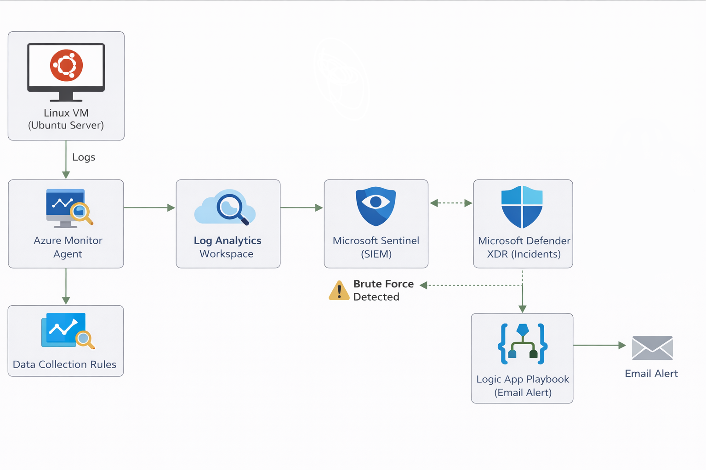
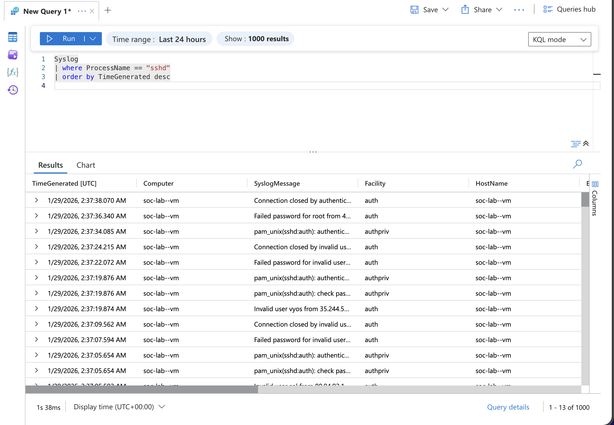

# Linux SSH Brute Force Detection with Microsoft Sentinel

## Overview
This project demonstrates an end-to-end SOC detection and response workflow using **Microsoft Sentinel** and **Microsoft Defender XDR** to identify and respond to SSH brute-force attacks against a Linux virtual machine hosted in Azure.

The lab focuses on realistic SOC analyst tasks including log ingestion, detection engineering using KQL, incident generation, and automated response using SOAR playbooks.

---

## Architecture

**Data flow:**

Linux VM (Ubuntu Server)  
→ Azure Monitor Agent via Data Collection Rules  
→ Log Analytics Workspace  
→ Microsoft Sentinel (SIEM)  
→ Microsoft Defender XDR (Incidents)  
→ Logic App Playbook (Email Alert)



---

## Environment
- **Cloud Platform:** Microsoft Azure  
- **Region:** Norway East  
- **Operating System:** Ubuntu Server 22.04 LTS  
- **SIEM:** Microsoft Sentinel  
- **XDR:** Microsoft Defender  
- **Automation:** Azure Logic Apps (SOAR)  
- **Log Source:** Linux Syslog (auth, authpriv)

---

## Log Ingestion
Linux authentication logs were ingested using **Azure Monitor Data Collection Rules**.

The following syslog facilities were collected:
- `auth`
- `authpriv`

This enabled visibility into SSH authentication events including:
- Failed password attempts
- Invalid user logins
- Successful SSH sessions



---

## Detection Logic (KQL)

The following KQL query detects potential SSH brute-force activity by identifying multiple failed authentication attempts within a short time window:

```kql
Syslog
| where ProcessName == "sshd"
| where SyslogMessage has_any ("Failed password", "Invalid user")
| summarize FailedAttempts = count() by Computer, bin(TimeGenerated, 5m)
| where FailedAttempts >= 5
```

## Detection Rationale
* Filters only SSH-related authentication events
* Groups activity into 5-minute time windows
* Uses a threshold to reduce false positives
* Detects both manual and automated brute-force attempts

---

## Alerting and Incident Management
* The analytics rule runs every 5 minutes
* Alerts are generated when thresholds are exceeded
* Alerts are promoted to incidents in Microsoft Sentinel
* Incidents are automatically visible in Microsoft Defender XDR

---

## Automated Response (SOAR)
An Azure Logic App playbook was implemented to automate incident response.

### Playbook behaviour
* Trigger: Microsoft Sentinel incident creation
* Action: Send email notification
* Content: Incident title severity timestamp and affected host

This provides immediate analyst notification when suspicious SSH activity is detected.

---

## Skills Demonstrated
* SIEM deployment and configuration
* Linux syslog ingestion using Azure Monitor
* Detection engineering with KQL
* SSH brute-force attack detection
* Entity mapping and incident creation
* SIEM to XDR integration
* SOAR automation using Azure Logic Apps

---

## Future Improvements
* Source IP–based brute-force correlation
* Geo-IP enrichment
* Automated blocking using Network Security Groups or firewalls
* Detection threshold tuning
* MITRE ATT&CK technique mapping

---

## Notes
This lab was built to closely mirror real SOC workflows and focuses on outcome-driven security monitoring rather than simulated or prebuilt detections.
